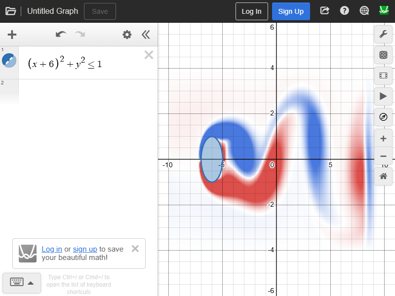
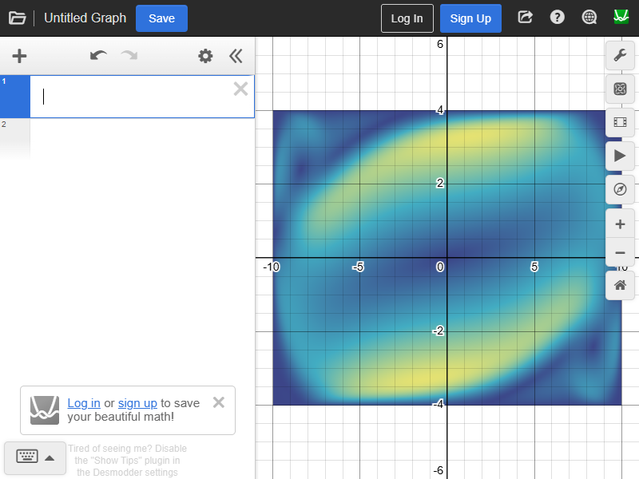
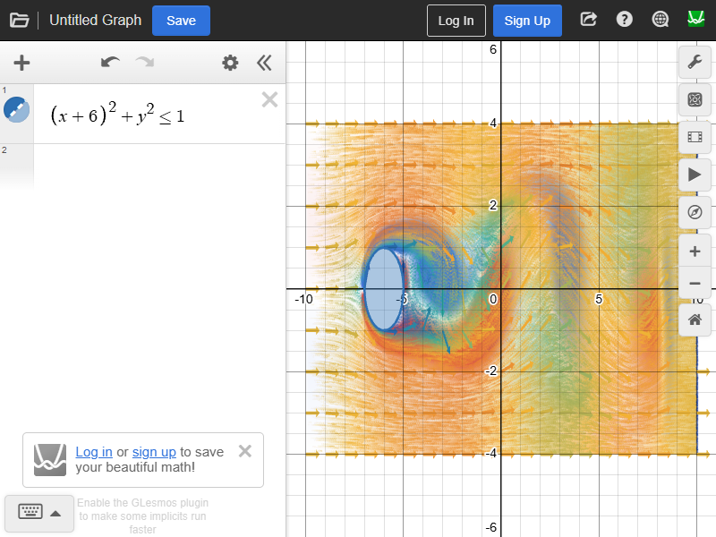
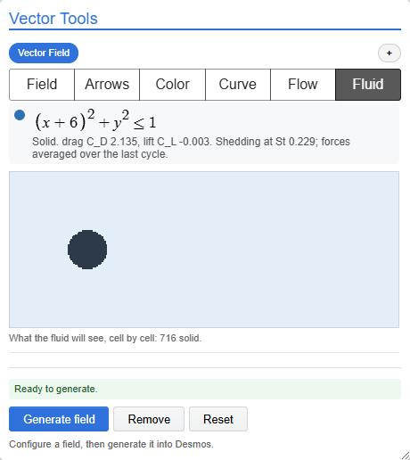

# The Fluid tab

_Built 2026-10-03 on `feature/vector-tools-foundation`, from the plan in
`VECTOR_TOOLS_FLUID_RESEARCH_BRIEF.md` and GPT's three research replies. Every
number below comes from a test in the repository that checks it on each run._

The sixth Vector Tools tab simulates a fluid on the GPU, round whatever the
graph shades. It has two fluids:

- **Wind tunnel.** Air enters on the left of a fixed tank and leaves on the
  right, flowing round every inequality in the expression list. Each solid's
  drag, lift and shedding frequency are measured.
- **Stirred box.** The field's own P and Q push a closed box of fluid. The
  fluid keeps the part of the push that curls and answers the part that
  spreads with pressure.

The liquid comes next (brief §8.0).

| Wind tunnel                                                    | Stirred box                                  |
| -------------------------------------------------------------- | -------------------------------------------- |
|                    |  |
|  |  |

## What it does

- **Solids are the graph's inequalities**, compiled strictly so the fluid sees
  exactly what Desmos shades: undefined is never solid
  (`FLUID_STRICT_GEOMETRY.md`). A hidden row lets the fluid through. Each row
  in the tab says whether it is a solid and, if not, why.
- **The tank is fixed in graph coordinates.** "Fit to view" moves it, and
  panning moves the picture, not the flow. A preview shows the tank cell by
  cell as the fluid sees it, with undefined cells in amber.
- **What is shown:** vorticity, speed or pressure, on a canvas under Desmos's
  own. The existing particles and arrows draw the flow while it runs, and the
  field's formula again when it stops.
- **Measurements:** each solid's C*D, C_L and, once its lift repeats steadily,
  its Strouhal number, with forces averaged over the last cycle. Before that
  the tab says why there is no number yet. Ticking "Write measurements into
  the graph" puts them in a folder as `C*{D1}`, `C*{L1}`and`S*{t1}`, with
  values still settling written as undefined.
- **Rafael's guards (brief §8.1):**
  - Lattice speed: Auto, Accurate or Lively. Auto halves the lattice speed and
    restarts if the flow anywhere passes Mach 0.3.
  - Resizing a solid: Auto updates it in place and marks the flow as settling;
    Strict restarts.
  - Dragging above Re 200: Auto or Strict.
  - Writeback is opt-in.
- **The clock** steps a fixed dt; frames only decide how many steps to run. A
  slow machine runs slower than real time and says so, and never changes the
  physics.

## How it works

| Piece                   | Where                                                    | What it is                                                                                                                                          |
| ----------------------- | -------------------------------------------------------- | --------------------------------------------------------------------------------------------------------------------------------------------------- |
| Strict geometry         | `src/field-rendering/sim/strict*.ts`                     | LaTeX to a tree, to a CPU evaluator with Desmos's measured rules, and to GLSL with a validity flag beside every value                               |
| Obstacles               | `sim/obstacles.ts`                                       | an inequality as `contains`, a signed function whose zero is the wall, and a tank rasterizer                                                        |
| Lattice, CPU reference  | `sim/lbm/d2q9.ts`, `boundaries.ts`                       | D2Q9, BGK with Guo forcing and an optional Smagorinsky closure, shifted float32 populations, walls, Zou–He open sides, solids, sponge, force fields |
| Lattice, GPU            | `sim/lbm/GpuD2Q9.ts`                                     | the same, one fragment pass per step, four RGBA32F targets; tables generated from the TypeScript so the two cannot drift                            |
| Walls and forces        | `sim/lbm/links.ts`                                       | interpolated bounce-back from the signed function (16 samples, 24 bisections), momentum-exchange force, compensated sums                            |
| Benchmarks              | `sim/lbm/dfg.ts`                                         | the DFG cylinder channels, set up from Desmos LaTeX                                                                                                 |
| Shedding                | `sim/measure.ts`                                         | GPT's acceptance rule: three cycles, a real swing, periods within 2%                                                                                |
| Scheduler, units, probe | `StepScheduler.ts`, `latticeUnits.ts`, `capabilities.ts` | fixed steps; graph units to lattice units; a GPU check that renders and reads back                                                                  |
| Display                 | `sim/FluidOverlay.ts`                                    | the lattice's context, and a two-pass display: a value per cell, then a filtered screen pass                                                        |
| The tab                 | `plugins/vector-tools/fluid/`                            | `FluidSession` (lattice, clock, measurements, guards), `FluidGraphWriter` (writeback)                                                               |

## How it was verified

The CPU reference is checked against exact solutions. The GPU is checked
against the CPU, step by step. The whole path, from Desmos LaTeX to GPU
forces, is checked against the official DFG benchmarks and GPT's independent
CPU oracle.

| Check                                                      | Result                                                                   |
| ---------------------------------------------------------- | ------------------------------------------------------------------------ |
| Desmos edge cases (143) and rational exponents (60)        | CPU evaluator matches live Desmos on every one; GLSL within float32      |
| 30, 60, 120 and 144 Hz frames, and jittered frames         | bit-identical states step for step                                       |
| GPU against CPU, bulk, one step / 100 steps                | 4·10⁻⁹ / 2.5·10⁻⁸ per population                                         |
| GPU against CPU, every boundary, BFL, closure, force field | within 5·10⁻⁸ / 2·10⁻⁷                                                   |
| Taylor–Green vortex decay, 64 cells                        | 0.23% from 2νk²                                                          |
| Shifted float32, weak vortex                               | within 0.5% of float64, where unshifted float32 loses most of it         |
| Poiseuille (halfway walls) / Couette (moving lid)          | 0.2% / 10⁻⁴                                                              |
| Off-grid walls, BFL against halfway                        | 0.3% against 4.7%; matches GPT's oracle row for row                      |
| Drag in a pushed periodic box                              | balances the applied force to four decimals                              |
| Channel from rest, velocity inlet and pressure outlet      | parabola within 0.83% of the peak; interior flux within 0.014%           |
| DFG 2D-1, Re 20, 32 cells across                           | C_D 1.45%, Δp 1.10% from the benchmark; within 0.02% of GPT's oracle     |
| DFG 2D-2, Re 100, 32 cells across                          | peak C_D 0.95%, lift range −0.09%, St 0.17%; equal to the oracle to 4 dp |
| Stirred box, curl against gradient of the same strength    | the gradient moves the fluid at under 5% of the curl                     |

Evidence pictures: `assets/fluid-gate1-taylor-green.png`,
`fluid-gate2-poiseuille.png`, `fluid-gate3-dfg.png` and
`fluid-gate4-shedding.png`.

## Known limits

- **Moving solids are not yet quantitative.** A slider or `t` moves a solid
  in place, marked as settling (Auto), or restarts the flow (Strict). GPT's
  third round measured that PSM is the method for bounded motion, and that
  neither PSM nor IB conserves volume when a solid grows. That work is gate 6.
- **The reconstructed outlet bends the flow in its last two columns**, where
  a cell-centre ρu stops being the flux (0.5–0.6%). The sponge keeps this
  from reflecting, and nothing measures there.
- **Inlet corners.** The inlet holds the flow exactly uniform. With a solid
  close to it, the flow there wants to speed up along the walls to get round
  the solid, and the mismatch sheds weak vorticity from the inlet's two
  corners; the wind-tunnel picture's cylinder blocks a quarter of the tank
  only two diameters downstream. An empty tunnel shows none, on the CPU or on
  the GPU, which agree there step for step. Placing solids further from the
  inlet removes it.
- **The stirred box's strength is regulated, not taken literally.** The field
  gives the push its shape. The strength eases toward the typical speed,
  because a push shaped like a rotation spins a closed box up without
  inertial limit.
- **Desmos snaps tan(π/2) to infinity, and factorial is refused** in solids
  until the GPU has a tested Gamma.

## Next

- **Gate 6:** moving solids with PSM, and the material wall velocity they
  need.
- **The liquid** (brief §8.0).
- **Gate 7 onward:** 3D FieldPlay on the camera match in
  `DESMOS_3D_CAMERA.md`.
