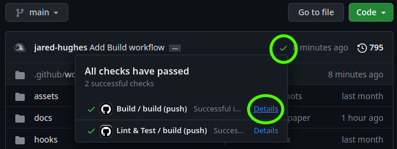
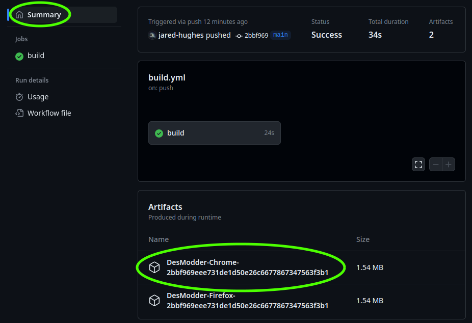

# Run Pre-Releases

This page details how to download and run pre-release builds of DesModder. Warning: there may be issues with these versions. Take care.

## Download

The first step is to identify which build you want to download. If you're here, you probably want the most recent version. If you were linked to a specific build, you can skip steps 1-4 below.

1. Navigate to https://github.com/DesModder/DesModder
2. Click the green checkmark
3. Click "Details" next to the workflow named "Build / build"
4. Click "Summary"
5. Click on the correct artifact to download, either `DesModder-Chrome-[hash]` or `DesModder-Firefox-[hash]` depending on if you are on Chrome (or most other browsers) or Firefox.

## Install (Chrome)

6. Unzip (extract) the downloaded zip file to somewhere
7. Navigate to chrome://extensions
8. Enable "Developer mode" (top-right)
9. Click "Load unpacked"
10. Select the unzipped folder

If you get the error "Manifest file is missing or unreadable," make sure you selected the folder itself and not a folder containing it.

## Install (Firefox)

6. Navigate to about:debugging
7. Click "Temporary Extensions"
8. Click "Load Temporary Add-on"
9. Select the downloaded zip file.
