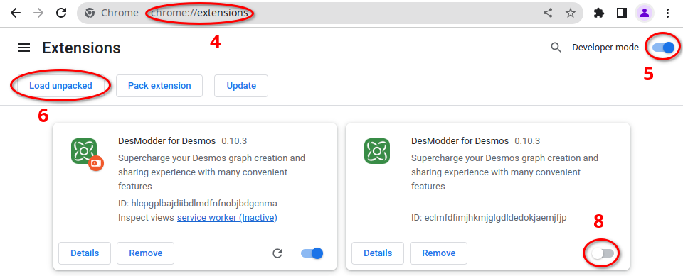
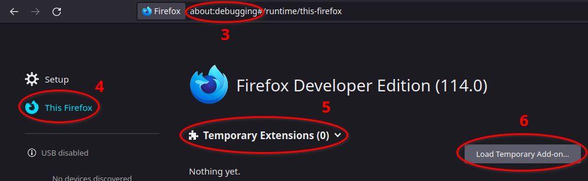

# Run Pre-Releases

This page details how to download and run pre-release builds of DesModder. Warning: there may be issues with these versions. Take care.

## Download

The first step is to identify which build you want to download.
If you're here, you probably want the most recent version.
If you were linked to a specific download, you can skip to step 3 using the downloaded file.

1. Navigate to [the nightly builds page](https://nightly.link/DesModder/DesModder/workflows/build/main).

2. Click the link in the **right column** corresponding to your browser. Chrome builds start with "DesModder-Chrome", and Firefox builds start with "DesModder-Firefox"

If you are using a browser that isn't Chrome or Firefox or you aren't sure what to use, choose Chrome.

## Install (Chrome/Other Browsers)

3. Unzip (extract) the downloaded zip file to a folder
4. Navigate to chrome://extensions
5. Enable "Developer mode" (top-right)
6. Click "Load unpacked"
7. Select the unzipped folder
8. If you already have DesModder from the webstore, **disable** that version.
   The prerelease version will have a red dot by its logo.

> If you get the error "Manifest file is missing or unreadable" in step 5, make sure you selected the folder itself and not a folder containing it.
> The correct folder will have a file called `manifest.json` directly inside.

## Install (Firefox)

3. Navigate to about:debugging
4. Choose "This Firefox" on the left
5. Click "Temporary Extensions"
6. Click "Load Temporary Add-on"
7. Select the downloaded zip file (do not extract).

